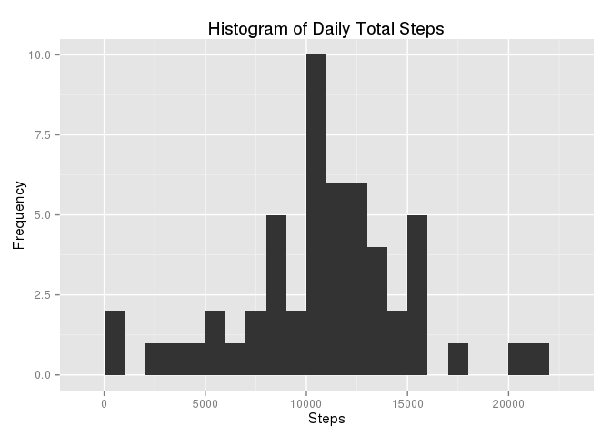
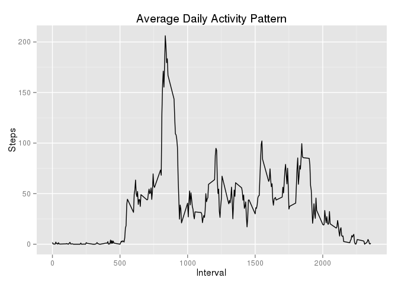
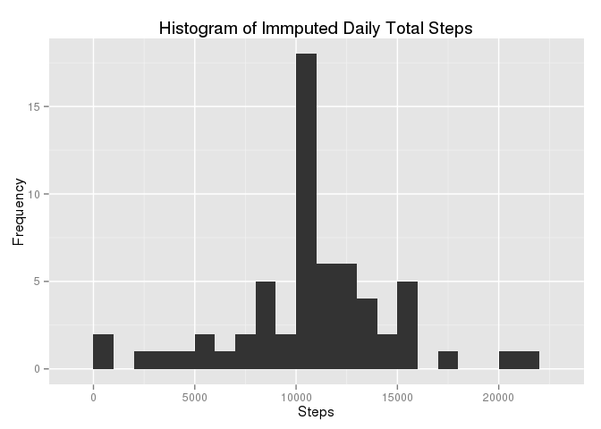
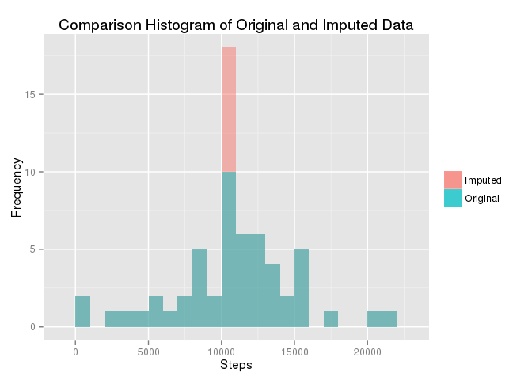

# Reproducible Research: Peer Assessment 1


## Loading and preprocessing the data


```r
# Everyone's favorite R packages!
library(ggplot2)
library(dplyr)

unzip('activity.zip')
activity <- read.csv('activity.csv')
```

## What is mean total number of steps taken per day?


```r
# compute daily totals
dailyStomps <- activity %>%
    group_by(date) %>%
    summarize(steps = sum(steps))

# make a histogram
with(dailyStomps, qplot(steps,
    geom = 'histogram',
    binwidth = 1000,
    main = 'Histogram of Daily Total Steps',
    xlab = 'Steps',
    ylab = 'Frequency'))
```

\

```r
# compute mean and median
meanDailyStomps <- mean(dailyStomps$steps, na.rm = TRUE)
medianDailyStomps <- median(dailyStomps$steps, na.rm = TRUE)
```

The mean number of daily steps is 10766.1886792, while the median is 10765.

We didn't remove the NA values when computing the daily totals, since that would effectively be recording 0 steps for that interval, which would drag the total down. By ignoring them, we get an NA total for any day with missing value, which we can then ignore when we calculate the daily average. Later on, we'll impute the missing values, replacing them with a sensible estimate that will be more reflective of reality.

## What is the average daily activity pattern?


```r
# compute mean by interval
intervalStomps <- activity %>%
    group_by(interval) %>%
    summarize(steps = mean(steps, na.rm = TRUE))

# plot it
with(intervalStomps, qplot(
    x = interval,
    y = steps,
    geom = 'line',
    main = 'Average Daily Activity Pattern',
    xlab = 'Interval',
    ylab = 'Steps'
))
```

\

```r
# find the interval with the highest mean
maxInterval <- as.numeric(intervalStomps %>%
    filter(steps == max(steps)) %>%
    select(interval))
```

The interval with the greatest mean number of steps over all the days is interval 835.

## Imputing missing values

It makes sense that the number of steps in a given interval would be related to the time of day, so we will replace missing values with the mean for that interval over all the other days. Conveniently, we already computed these in the last section.


```r
# How many values are missing?
numNAs <- sum(is.na(activity$steps))

# create new dataset with missing values replaced with the mean for that interval
activityImp <- merge(activity, intervalStomps, by = 'interval', suffixes = c('', 'Mean')) %>%
    arrange(date, steps) %>%
    mutate(steps = ifelse(is.na(steps), round(stepsMean), steps)) %>%
    select(steps, date, interval)

# repeat everything with the imputed data
dailyStompsImp <- activityImp %>%
    group_by(date) %>%
    summarize(steps = sum(steps))

with(dailyStompsImp, qplot(steps,
    geom = 'histogram',
    binwidth = 1000,
    main = 'Histogram of Immputed Daily Total Steps',
    xlab = 'Steps',
    ylab = 'Frequency'))
```

\

```r
meanDailyStompsImp <- mean(dailyStompsImp$steps, na.rm = TRUE)
medianDailyStompsImp <- median(dailyStompsImp$steps, na.rm = TRUE)
```

So, with the imputed data, the mean number of daily steps is 10765.6393443 and the median is 10762. The mean and median show hardly any difference from the previous, un-imputed data. To get a better idea of what happened, let's compare the histograms.


```r
ggplot(dailyStompsImp, aes_string('steps')) +
    geom_histogram(aes(fill = 'Imputed'), binwidth = 1000, alpha = 0.5) +
    geom_histogram(aes(fill = 'Original'), data = dailyStomps, binwidth = 1000, alpha = 0.5) +
    scale_colour_manual(values = c('red', 'blue')) +
    theme(legend.title = element_blank()) +
    xlab('Steps') + ylab('Frequency') +
    ggtitle('Comparison Histogram of Original and Imputed Data')
```

\

Disappointingly, it turns out that whenever there were values missing, they were missing for an entire day. That means when we imputed the missing data, the totals for the missing days were the same as the (rounded) mean daily total.

## Are there differences in activity patterns between weekdays and weekends?


```r
isWeekday <- function(date) {
    !(weekdays(date) %in% c('Saturday', 'Sunday'))
}

# mark the weekdays
activityImp <- activityImp %>%
    mutate(date = as.POSIXct(date), 
           weekday = as.factor(ifelse(isWeekday(date), 'Weekday', 'Weekend')))

# compute mean by interval
intervalStompsImp <- activityImp %>%
    group_by(weekday, interval) %>%
    summarize(steps = mean(steps, na.rm = TRUE))

# plot it
ggplot(intervalStompsImp, aes(x = interval, y = steps)) +
    geom_line() +
    facet_grid(weekday ~ .) +
    xlab('Interval') +
    ylab('Steps') +
    ggtitle('Weekday vs. Weekend Activity Patterns')
```

\
